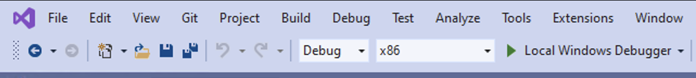
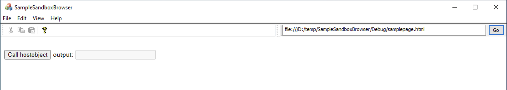
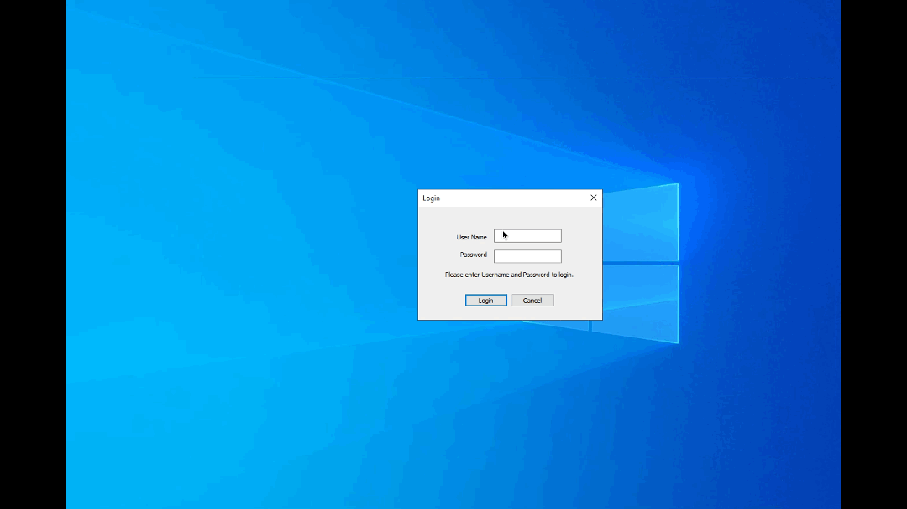

## Steps to build SampleSandboxBrowser using VS 2019:-

1. Open the **SampleSandboxBrowser.sln** in VS2019 & build the solution with **x86 configuration**. 
2. Observe that build is successful and exe is generated at "..\SampleSandboxBrowser\Debug"
3. Double clicking on the exe will launch the SandboxBrowser.

## About webcontent :-

- Here we are loading static html page. Which is present in "..\SampleSandboxBrowser\Debug" folder named as "samplepage.html".
- Here is the UI which just containing the one HTML button and one Input box. 
- On button click we are calling the hostobject which is returning the username. And that username we are rendring in Input Box.
  HostObject :- await window.chrome.webview.hostObjects.common.userName;
- In the application we have option to open anather instance of WebView2 browser i.e. through the File -> New Window

## About WebView2 Runtime & SDK used in this app :-

- Here we are using the Fixed WebView2 runtime version of x86 Architecture.
- In "..\SampleSandboxBrowser\Debug" we can wee we have 2 folders i.e. "Webview2Runtime_98" & "Webview2Runtime_108" this is extracted cab file of
  runtime version **98.0.1108.62** & **108.0.1462.46** respectively.
- Currently its configured for "Webview2Runtime_108" in [`MainFrame.cpp`](./SampleSandboxBrowser/MainFrm.cpp/). Method Name :- `InitializeWebView()`
- About SDK - we have used latest version i.e. **1.0.1462.37** SDK in this app.

## Problem statement :-

- While using the "WebView2Runtime_108" If we have 2 webview2 instances running at same time, In the second instance we are not able to call the hostobject.
- This issue was not present in "Webview2Runtime_98", If we changed the runtime path present in InitializeWebView() method from "Webview2Runtime_108" to "Webview2Runtime_98"
  the above mentioned issue is not reproducible.

## Workflows which having issues while accessing the hostobject :-

### Workflow 1 :-

    1. Launch the SampleSandboxBrowser ( i.e. "..\SampleSandboxBrowser\Debug\SampleSandboxBrowser.exe" )
    2. Give some random username and password
    3. Click on login button
    4. Click on the "Call hostobject" button present in browser
    5. Verify username is rendered in inputbox
    6. In top menubar click on File -> New Window option
    7. Perform step 4th & 5th in the new window
    8. Observed inputbox is still empty i.e hostobject is not returned any value. This is an issue.

### Workflow 2 :-

    1. Launch the SampleSandboxBrowser
    2. Give some random username and password
    3. Click on login button
    4. Click on the "Call hostobject" button present in browser
    5. Verify username is rendered in inputbox
    6. Launch the SampleSandboxBrowser 2nd instance
    7. Give some random username and password
    8. Click on login button
    9. Click on the "Call hostobject" button present in browser
    10.Observed inputbox is still empty i.e hostobject is not returned any value. This is an issue.

### Required NuGet Packages.

SampleSandboxBrowser requires below 2 nuget packages. In case any issue with these packages while solution build, update or re-install these Nuget packages from visual studio "Manage Nuget Packages for solution".

- "Microsoft.Web.WebView2"
- "Microsoft.Windows.ImplementationLibrary"
